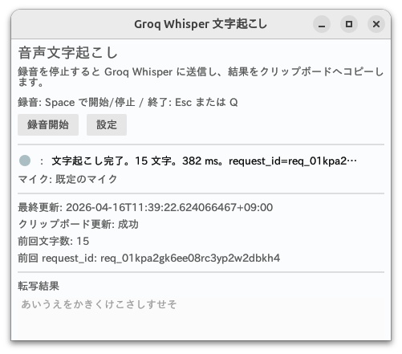

# Groq Whisper GUI App

<p align="center">
  
</p>

[Groq Whisper API](https://console.groq.com/docs/speech-to-text) を利用する Rust 製のGUI アプリです。アプリをフォーカスした状態でショートカットキーにより録音を開始・停止し、録音中に音声を逐次 MP3 エンコードし、停止後に文字起こし API を呼び出して結果をクリップボードへ反映します。

## 主な機能

| 機能 | 内容 | 補足 |
| --- | --- | --- |
| 録音開始 / 停止 | ショートカットキーで録音をトグルできます。 | 既定は `Space`。例えば`Ctrl+S` で開始、`Ctrl+E` で停止する等、分離運用もカスタマイズ可能です。 |
| 入力デバイス選択 | 使用するマイク入力デバイスを切り替えられます。 | PipeWire / PulseAudio / ALSA 環境を前提とします。 |
| 録音状態表示 | 録音中インジケータと簡易レベル表示を提供します。 | 状態確認をしながら録音できます。 |
| MP3 エンコード | 録音中の PCM を逐次 MP3 へ変換します。 | 既定は `lame`。`ffmpeg` も選択できますが、`libmp3lame` 対応ビルドが必要です。 |
| Groq Whisper 送信 | 録音停止後に Groq Whisper API へ音声を自動送信します。 | 手動アップロードなしで文字起こしまで進みます。 |
| クリップボード反映 | 転写結果を自動でクリップボードへ反映します。 | 他アプリへの貼り付けをすぐ行えます。 |
| Whisper モデル切替 | 使用する文字起こしモデルを切り替えられます。 | `whisper-large-v3-turbo` が既定、`whisper-large-v3` も選択できます。 |
| GPU オフロード設定 | GPU 利用モードを保持できます。 | `off / auto / cuda / qsv / amf / vaapi`。現状の音声専用 MP3 パイプラインでは主に拡張設定です。 |
| 実行結果の記録 | 最終転写時刻、文字数、clipboard 更新成否を保持します。 | 軽い動作確認やトラブルシュートに使えます。 |

## 前提条件

以下を事前に用意してください。

| 項目 | 必須度 | 用途 / 補足 |
| --- | --- | --- |
| Rust stable / `cargo` | 必須 | ビルドと実行に使用します。 |
| `lame` | 必須 | 既定の MP3 エンコーダーです。通常利用ではこれを使います。 |
| `ffmpeg` | 必須 | fixture のデコード、スモークテスト、`--mp3-encoder ffmpeg` 利用時に使用します。 |
| `ffprobe` | 必須 | 生成した音声の検証に使用します。通常は `ffmpeg` パッケージに含まれます。 |
| `curl`, `jq` | 必須 | API スモークテストや応答確認に使用します。 |
| `just` | 任意 | `justfile` のレシピを使う場合に導入します。 |
| `cargo-machete` | 任意 | `just machete` / `just quality` で未使用依存を確認する場合に導入します。 |
| Groq API キー | 必須 | 文字起こし API の呼び出しに必要です。 |
| マイク入力環境 | 必須 | PipeWire / PulseAudio / ALSA のいずれかを前提とします。 |
| X11 または Wayland セッション | 必須 | GUI 表示とクリップボード連携に必要です。 |

- `--mp3-encoder ffmpeg` を使う場合は、`libmp3lame` 対応の `ffmpeg` ビルドが必要です。
- `ffmpeg` 側でエンコードに失敗しても、自動で `lame` へ切り替わることはありません。バックエンドは明示的に選択してください。

## インストール

### 1. Rust の導入

```bash
curl https://sh.rustup.rs -sSf | sh
source "$HOME/.cargo/env"
```

### 2. 依存パッケージの導入

Ubuntu 22.04 LTS / 24.04 LTS での利用を想定・動作確認しています。音声入力は PipeWire / PulseAudio / ALSA、クリップボード連携は X11 または Wayland を前提とします。

#### 2.1 必須パッケージ

```bash
sudo apt update
sudo apt install -y ffmpeg lame curl jq
```

`ffprobe` は通常 `ffmpeg` と一緒に導入されます。

#### 2.2 任意ツール

`justfile` を使う場合は、`just` を追加で導入してください。

```bash
cargo install just --locked
```

このリポジトリの `justfile` を使う場合は、導入後に `just build` や `just test` を実行できます。

`cargo-machete` は、未使用依存の確認を行う場合に追加で導入してください。

```bash
cargo install cargo-machete --locked
```

### 3. API キーの設定

最低限、以下を設定してください。

```bash
export GROQ_API_KEY='gsk_xxx'
```

必要に応じて以下も利用できます。

```bash
export GROQ_BASE_URL='https://api.groq.com/openai/v1'
export GROQ_WHISPER_MODEL='whisper-large-v3-turbo'
export GROQ_WHISPER_LANGUAGE='ja'
export GROQ_MP3_ENCODER='lame'
export GROQ_LAME_PATH='/usr/bin/lame'
```

## ビルド

```bash
cargo build --release
# または
just build
# または
bash scripts/build.sh
```

`just build` と `bash scripts/build.sh` は、どちらも内部で `cargo build --release` を実行します。ビルド後の実行ファイルは `target/release/groq-whisper-app` に生成されます。

PATH の通った場所へ配置して使う場合は、たとえば以下のように配置できます。

```bash
install -Dm755 target/release/groq-whisper-app "$HOME/.local/bin/groq-whisper-app"
```

## 実行

以下の `groq-whisper-app` は、PATH の通った場所に配置済みのバイナリを前提としています。

### 既定起動

```bash
cargo run --release
# または
groq-whisper-app
```

### Debug UI で起動 (文字起こし内容がテキストボックスに表示されます)

```bash
just run-debug
# または
bash scripts/run-debug.sh
# または
groq-whisper-app --ui-mode debug
```

### 開始 / 停止ホットキーを分離して起動

```bash
cargo run --release -- --start-hotkey Ctrl+S --stop-hotkey Ctrl+E
# または
groq-whisper-app --start-hotkey Ctrl+S --stop-hotkey Ctrl+E
```

### MP3 バックエンドを明示して起動

```bash
# 既定の lame バックエンド
cargo run --release -- --mp3-encoder lame --lame-path /usr/bin/lame
# または
groq-whisper-app --mp3-encoder lame --lame-path /usr/bin/lame

# ffmpeg バックエンド（libmp3lame 必須）
cargo run --release -- --mp3-encoder ffmpeg
# または
groq-whisper-app --mp3-encoder ffmpeg
```

### ビットレート・出力設定を調整して起動

```bash
cargo run --release -- --bitrate-kbps 48 --output-sample-rate 16000 --output-channels 1
# または
groq-whisper-app --bitrate-kbps 48 --output-sample-rate 16000 --output-channels 1
```

## 使い方

1. アプリを起動します。
2. 必要に応じて設定画面で入力デバイスを選択します。
3. アプリをフォーカスした状態で `Space` を押すと録音を開始します。
4. 発話します。
5. 再度 `Space` を押すと録音を停止します。
6. 録音停止後、Groq API へ自動送信されます。
7. 転写結果がクリップボードへ反映されます。
8. Debug UI では転写結果とデバッグログを確認できます。
9. `q`キーあるいは `ESC`キーでアプリを終了できます。

## 主な CLI オプション

利用可能な CLI オプションは、実行時に `--help` または `-h` で確認してください。

```bash
cargo run --release -- --help
# または
groq-whisper-app --help
# または
groq-whisper-app -h
```
